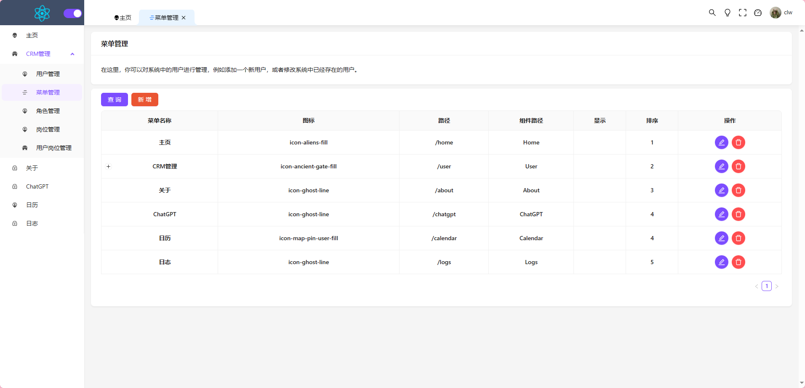
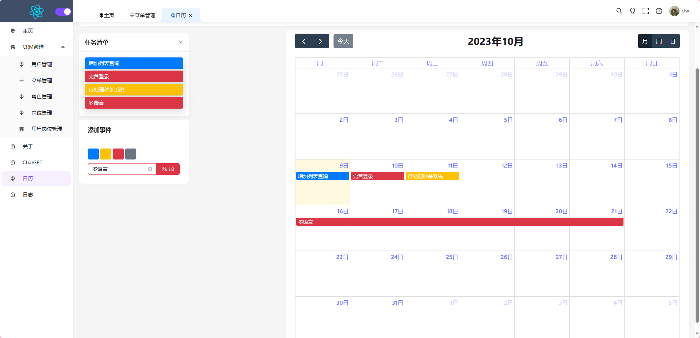

# React-Admin 🐱‍🏍🐱‍🏍🐱‍🏍

### 介绍

基于 React18、React-Router-Dom v6、React-Hooks、Recoil(react 下一代状态管理工具)、TS、Vite4.1、Ant-Design 开源的一套后台管理框架。

### 一、在线预览地址

- web 项目地址 ☞ https://jiuxiangyangguang.github.io/react-admin/
- 由于服务器到期后台服务可能无法访问 ☠
- web 项目登录需要用户名:yonghu1,密码:123456

### 二、Git 仓库地址

- web 项目 ☞ [jiuxiangyangguang/react-admin: react-后台管理项目 (github.com)](https://github.com/jiuxiangyangguang/react-admin)

- 后台 nestJs ☞ [jiuxiangyangguang/nestJs (github.com)](https://github.com/jiuxiangyangguang/nestJs)  (依赖Redis,MySQL)

- docker部署  ☞ [docker部署详情](#docker)


### 三、项目简介

- ✨ 采用最新技术找开发：react18 recoil(原子化状态管理) vite4.0 Ts react-router-domV6 Antd5
- ✨ 采用 最新 Vite4.0 转为打包工具,配置了 Svg 自动引入,less 解析,Postcss 兼容
- ✨ 摒弃繁琐的 Redux,使用最新 react 下一代状态管理工具 recoil,原子化管理将状态与业务分离回归状态管理的本质
- ✨ 使用最新版 react-router-domV6,实现动态路由,面包屑,导航栏,支持路由切换动画
- ✨ 目前完善了权限管理系统 菜单=>角色=>岗位=>权限,用户对应多岗位
- ✨ 以日历形式支持任务清单,支持拖拽
- ✨ 使用 Prettier 统一格式化代码，集成 Eslint、Stylelint 代码校验规范
- 🐱‍🚀 由于开发时间有限很多功能为完善,有时间就会补充

### 四、后续待优化

- 🎉 完善权限管理功能
- 🎉 增加多语言切换功能
- 🎉 增加全局主题,可一件配置页面动画,颜色,按钮大小等等 并增加配置保存与分享功能
- 🙇‍🙇‍🙇‍ 有 Bug 或好玩的新功能欢迎在 issues 提出,看到了会第一时间回复 😊

### 四、安装使用步骤

- 克隆项目到本地

```bash
git https://github.com/jiuxiangyangguang/react-admin.git
```

- **切换 dev 分支 由于服务器到期部分后台服务未部署请切换至 dev 分支浏览账号密码随便填**

```bash
git checkout dev
```

- 安装依赖 (推荐使用 yarn)

```bash
yarn
```

```bash
npm i
```

- 运行项目(使用main 分支时需要先启动[后台项目](https://github.com/jiuxiangyangguang/nestJs)不然无法登录,后台服务依赖于Redis,MySQL,建议使用Dockery拉取镜像以体验完整功能)

```bash
yarn dev
```

- 打包使用

```bash
yarn build
```

- 部署使用 docker 详情可见 package.json 文件 支持 gulpfile 一键部署到服务器
- <a id="docker"></a>Docker部署  可体验完整功能

### 五、项目截图

- login 界面


- 首页(全展开)



- 全局配置页


- 工作日历页(支持拖拽)


