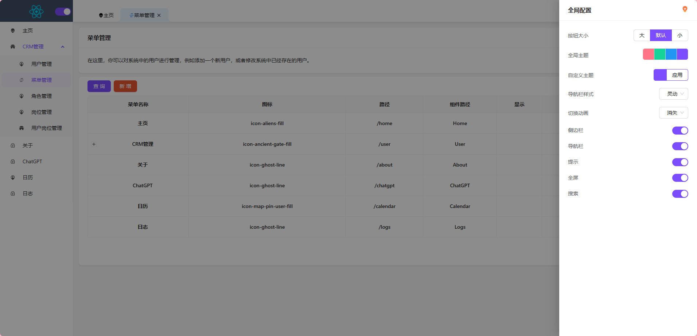

# React-Admin 🐱‍🏍🐱‍🏍🐱‍🏍

### 介绍 

基于 React18、React-Router-Dom v6、React-Hooks、Recoil(react下一代状态管理工具)、TS、Vite4.1、Ant-Design 开源的一套后台管理框架。

### 一、在线预览地址 

- web项目地址 ☞ https://jiuxiangyangguang.github.io/react-admin/  
- 由于服务器到期后台服务可能无法访问☠ 
- web项目登录需要用户名:yonghu1,密码:123456

### 二、Git 仓库地址 

- web项目  ☞ [jiuxiangyangguang/react-admin: react-后台管理项目 (github.com)](https://github.com/jiuxiangyangguang/react-admin)
- 后台nestJs ☞ [jiuxiangyangguang/nestJs (github.com)](https://github.com/jiuxiangyangguang/nestJs)

### 三、项目简介

- ✨ 采用最新技术找开发：react18  recoil(原子化状态管理)  vite4.0  Ts  react-router-domV6  Antd5 
- ✨ 采用 最新Vite4.0转为打包工具,配置了Svg自动引入,less解析,Postcss兼容
- ✨ 摒弃繁琐的Redux,使用最新react下一代状态管理工具recoil,原子化管理将状态与业务分离回归状态管理的本质
- ✨ 使用最新版react-router-domV6,实现动态路由,面包屑,导航栏,支持路由切换动画
- ✨ 目前完善了权限管理系统 菜单=>角色=>岗位=>权限,用户对应多岗位
- ✨ 以日历形式支持任务清单,支持拖拽 
- ✨ 使用 Prettier 统一格式化代码，集成 Eslint、Stylelint 代码校验规范
- 🐱‍🚀 由于开发时间有限很多功能为完善,有时间就会补充 

### 四、后续待优化

- 🎉 完善权限管理功能
- 🎉 增加多语言切换功能
- 🎉 增加全局主题,可一件配置页面动画,颜色,按钮大小等等 并增加配置保存与分享功能
- 🙇‍🙇‍🙇‍有其他需求或好玩的新功能可在issues提出无效😊

### 四、安装使用步骤 

- 克隆项目到本地

```bash
git https://github.com/jiuxiangyangguang/react-admin.git
```

- 安装依赖

```bash
# 推荐使用yarn
yarn

# 或者 npm
npm i
```

- 运行项目(需要先启动[后台项目](https://github.com/jiuxiangyangguang/nestJs)不然无法登录)

```bash
# 开发环境
yarn dev
```

- 打包使用  `"build": "vite build"`  其他均为docker发布使用如未安装docker也不会对项目产生任何影响

```bash
yarn build
```


### 五、项目截图

- login界面


- 首页(全展开)


- 全局配置页



- 工作日历页(支持拖拽) 


